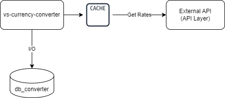

# Currency Converter Service - CCS

## Proposal

**Currency Converter Service, or CCS**, is a simple REST API that allows you to convert money between different types of currencies.
The service obtains, through the [API Layer](https://apilayer.com/marketplace/exchangerates_data-api) service, the quotation of currencies in relation to a base currency (Euro).
**API Layer** is an external and non-public service, which has a free version, but with limitations on requests and frequency of information updates.

Initially, the **CCS** has the following currency options: Brazilian Real (BRL), Japanese Yen (JPY), American Dollar (USD), and Euro (EUR).
To add new currencies, it will be necessary to ensure that the **API Layer** supports this new currency, 
in addition to adding this record to the Currency enum of **CCS**.

**CCS** allows the execution of money conversion routines and transaction history query.
In total, three operations are available through the REST API.

1. **Conversion**
    1. **Converter** - Converts the amount of one currency into another;
    2. **Get Transaction** - Retrieves an already performed conversion transaction;
    3. **Find All Transactions** - Lists all conversion transactions performed for a user.

## Service premises

1. As it is a microservice, **CCS** does not perform any registration or validation of user information;
2. Conversions with the same source and target currency will be recorded in the database, even if there is no change in their amount;
3. Money values have two decimal places;
4. Rate values have seven decimal places;
5. All conversion is done using a base currency (Euro). Therefore, it is necessary to calculate conversion rates, 
so every conversion will have three rates: Rate of source currency to base currency; Rate of base currency to target currency; 
and Composite Rate, which is the calculation of the source currency to target currency (Calculation method: Target Amount / Source Amount);
6. The **API Layer** has a daily update frequency, so a cache was added to avoid making unnecessary requests;
7. A service was developed, in the CCS itself, to clear the cache every day at midnight, 
believing that the first moment after the change of day the API Layer will have already been updated;
8. Any communication error with the **API Layer** will be considered Failed Dependency (Http Status 424). 

## Limitations
- API access security routines (authentication and authorization) were not implemented, for example, [OAuth2 Security](https://oauth.net/2/). 
This way, any request received will be processed;
- There is no integration between **CCS** and any log indexing tools, for example, [Kibana](https://www.elastic.co/pt/kibana);
- There is no integration between **CCS** and any APM (Application Performance Management) tools;
- No static code analysis tool was used, only Jacoco to check test coverage;
- No password vault ([Vault](https://www.vaultproject.io/)) was used to hide access credential information exposed on the
application source code;
- No deployment was performed in any environment, for example, [Heroku](https://dashboard.heroku.com/)

## Language, framework and versions

Java, in its 21st version, was used as a programming language for the development of the CCS service. The [Spring Boot](https://spring.io/projects/spring-boot) framework was used in its version 3.2.1.

## Resources used

The main resources used for the development of Customer Service are listed below:
1. [Lombok](https://projectlombok.org/) - Java library that automatically creates some resources to manipulate objects;
2. [H2](https://www.h2database.com/html/main.html) - In-memory relational database management system written in Java;
3. [MapStruct](https://mapstruct.org/) - Code generator that simplifies the implementation of mappings between DTOs (Data Transfer Object) classes and Entity classes;
4. [JUnit 5](https://junit.org/junit5/) - Framework used to perform unit and integrated tests;
5. [Mockito](https://site.mockito.org/) - Testing framework that allows the creation of test double objects in automated unit tests;
6. [REST Assured](https://rest-assured.io/) - Library that allows you to test REST services, in a simplified way, in Java;
7. [JaCoCo](https://www.eclemma.org/jacoco/) - Code coverage library;
8. [Swagger](https://swagger.io/) - Framework composed of several tools that assist in the description, consumption and visualization of services from a REST API;
9. [WireMock](https://www.wiremock.io/) - Tool that enables the simulation of HTTP-based API services;
10. [Flyway](https://flywaydb.org/) - Open source database migration tool;
11. [OpenFeign](https://spring.io/projects/spring-cloud-openfeign) - HTTP client library that facilitates communication with RESTful APIs in Java;
12. [Resilience4J](https://resilience4j.readme.io/) - Lightweight fault tolerance library;
13. Caffeine - High-performance cache library for Java;

## Architecture

The architecture used by **CCS** is presented below.
As it is a simple service, it currently only has 4 components, namely:
API Layer (External API), Currency Conversion Service, Caffeine Cache, and Database (H2).

The database (db_converter) only has the _tb_user_conversion_ table, described below.

    Columns:
      id_conversion: String, primary key - UUID;
      id_user: Long, not null;
      cd_source_currency: String, not null;
      vl_source_amount: BigDecimal, not null;
      cd_target_currency: String, not null;
      vl_target_amount: BigDecimal, not null;
      vl_rate_source: BigDecimal, not null;
      vl_rate_target: BigDecimal, not null;
      vl_rate_compose: BigDecimal, not null;
      dt_register: Timestamp, not null;

## Unit and Integrated tests

**44** tests were developed, including **25 unit tests** and **19 integration tests**.
In total, more than **90%** of the service's lines of code were covered.

- Windows
   - Unit Tests: `.\gradlew.bat test`
   - Integrated Tests: `.\gradlew.bat integrationTest`
   - Jacoco Report: {dir_project}/build/reports/jacoco/test/html/index.html

- Linux and Mac
   - Unit Tests: `.\gradlew test`
   - Integrated Tests: `.\gradlew integrationTest`
   - Jacoco Report: {dir_project}/build/reports/jacoco/test/html/index.html

## Continuous Integration

Github's GitActions has been configured to ensure continuous integration. 
Thus, every push or pull request that occurs in the master branch initiates checkstyle validation 
and unit and integrated testing of the code.

## Log Records

Logs of information, debugs and errors were inserted.
The information logs contain parameter values, to facilitate eventual analysis and traceability.

Service error situations are captured, treated and returned to users through friendly messages.

The main system errors return response statuses of HTTP 400 (_Bad Request_), HTTP 404 (_Not Found_) 
and HTTP 424 (_Failed Dependency_), however there may be some unmapped situations. In these cases, 
the server will return HTTP response status 500 (_Internal Server Error_).

## API Documentation

CCS uses the [Swagger](https://swagger.io/) tool to describe the available APIs (`/swagger-ui/index.html`).

## Build

The service was developed using [Gradle 8.4](https://gradle.org/).

To build the project, the user must have Gradle installed on their computer.

In the operating system terminal, go to the project root folder and execute the command:

`gradle wrapper`

After finishing the previous execution, execute:

- Windows: `.\gradlew.bat clean build`
- Linux ou Mac: `.\gradlew clean build`

## Run

A _Dockerfile_ file was made available to create the service image (Currency Converter Service).
In addition to this file, the _docker-compose.yml_ file was also made available, with the necessary 
settings to start the service locally.

The _docker-compose.yml_ file has the command that will initialize the Currency Converter Service. 
Therefore, if _docker-compose.yml_ is not changed, it is necessary to ensure that port `8080` is not 
being used by other processes.

Before executing the Docker command, it is necessary to build the project (Currency Converter Service).
When executing _docker-compose.yml_ the _Dockerfile_ will also be executed, for this purpose it is necessary 
to have [docker-compose](https://docs.docker.com/compose/) installed and configured on your machine.

Command to start docker-compose: `docker-compose up -d`

If you want to run the local code, without the help of the docker image, just go to the service directory
(Currency Converter Service) and run the command:

- Windows: `.\gradlew.bat bootRun`
- Linux and Mac: `.\gradlew bootRun`

## Author and Contact

- Author: Vanderson Sampaio
- Email: vandersons.sampaio@gmail.com
- Github: https://github.com/vandersonsampaio
- Linkedin: https://www.linkedin.com/in/vanderson-sampaio-399973158/
